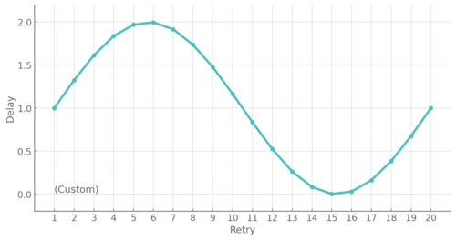

# Backoff

[](https://packagist.org/packages/code-distortion/backoff)

[](https://github.com/code-distortion/backoff/actions)
[](https://plant.treeware.earth/code-distortion/backoff)
[](.github/CODE_OF_CONDUCT.md)


***code-distortion/backoff*** is a PHP library that retries your actions when they fail. It implements various backoff strategies and jitter to avoid overwhelming the resource being accessed.

It's useful when you're working with services that might be temporarily unavailable, such as APIs.

```php
// let Backoff manage the delays and trigger retries for you
$action = fn() => …; // do some work
$result = Backoff::exponential(2)->maxAttempts(10)->maxDelay(30)->attempt($action);
```

> See the [cheatsheet](#cheatsheet) for an overview of what's possible.
 


## Table of Contents

- [Installation](#installation)
- [General Backoff Tips](#general-backoff-tips)
  - [Further Reading](#further-reading)
- [Cheatsheet](#cheatsheet)
- [Usage](#usage)
- [Backoff Algorithms](#backoff-algorithms)
  - [Fixed Backoff](#fixed-backoff)
  - [Linear Backoff](#linear-backoff)
  - [Exponential Backoff](#exponential-backoff)
  - [Polynomial Backoff](#polynomial-backoff)
  - [Fibonacci Backoff](#fibonacci-backoff)
  - [Decorrelated Backoff](#decorrelated-backoff)
  - [Random Backoff](#random-backoff)
  - [Sequence Backoff](#sequence-backoff)
  - [Callback Backoff](#callback-backoff)
  - [Custom Backoff Algorithm Class](#custom-backoff-algorithm-class)
  - [Noop Backoff](#noop-backoff)
  - [No Backoff](#no-backoff)
- [Configuration (Customise the Retry Logic)](#configuration-customise-the-retry-logic)
  - [Max Attempts](#max-attempts)
  - [Delay](#delay)
    - [Max-Delay](#max-delay)
    - [Immediate First Retry](#immediate-first-retry)
  - [Jitter](#jitter)
    - [Full Jitter](#full-jitter)
    - [Equal Jitter](#equal-jitter)
    - [Custom Jitter Range](#custom-jitter-range)
    - [Jitter Callback](#jitter-callback)
    - [Custom Jitter Class](#custom-jitter-class)
    - [No Jitter](#no-jitter)
- [Managing Exceptions](#managing-exceptions)
  - [Retry When Any Exception Occurs](#retry-when-any-exception-occurs)
  - [Retry When Particular Exceptions Occur](#retry-when-particular-exceptions-occur)
  - [Don't Retry When Exceptions Occur](#dont-retry-when-exceptions-occur)
- [Managing "Invalid" Return Values](#managing-invalid-return-values)
  - [Retry When…](#retry-when)
  - [Retry Until…](#retry-until)
- [Callbacks](#callbacks)
  - [Exception Callback](#exception-callback)
  - [Invalid Result Callback](#invalid-result-callback)
  - [Success Callback](#success-callback)
  - [Failure Callback](#failure-callback)
  - [Finally Callback](#finally-callback)
- [Logging](#logging)
  - [The AttemptLog Class](#the-attemptlog-class)
- [Working With Test Suites](#working-with-test-suites)
  - [Disabling Backoff Delays](#disabling-backoff-delays)
  - [Disabling Retries](#disabling-retries)
- [Managing the Retry Loop Yourself](#managing-the-retry-loop-yourself)
  - [The Basic Loop](#the-basic-loop)
  - [Catching Exceptions in Your Loop](#catching-exceptions-in-your-loop)
  - [Deconstructing the Backoff Logic](#deconstructing-the-backoff-logic)
  - [Working With Logs](#working-with-logs)
  - [Helpers When Managing The Loop Yourself](#helpers-when-managing-the-loop-yourself)
- [Modelling / Simulation](#modelling--simulation)


## Installation

Install the package via composer:

```bash
composer require code-distortion/backoff
```


## General Backoff Tips

- Backoff attempts are intended to be used when actions fail because of **transient** issues (such as temporary service outages). When **permanent** errors occur (such as a 404 HTTP response), [retrying should stop](#managing-exceptions) as it won't help.
- Be careful when nesting backoff attempts. This can unexpectedly increase the number of attempts and time taken.
- Actions taken during backoff attempts should be idempotent. Meaning, if the same action is performed multiple times, the outcome should be the same as if it were only performed once.


### Further Reading

- The article [Timeouts, retries, and backoff with jitter](https://aws.amazon.com/builders-library/timeouts-retries-and-backoff-with-jitter/) by Marc Brooker at AWS does a good job of explaining the concepts involved when using backoff strategies.
- The article [Exponential Backoff And Jitter](https://aws.amazon.com/blogs/architecture/exponential-backoff-and-jitter/) also by Marc Brooker is a good read if you're interested in the theory behind backoff algorithms and jitter. Marc [explains the same concepts in a 2019 talk](https://www.youtube.com/watch?v=sKRdemSirDM&t=1896s).


## Cheatsheet

Quick examples…

```php
// the usual case
$action = fn() => …; // do some work
$result = Backoff::exponential(2)->maxAttempts(10)->maxDelay(30)->attempt($action);

// selection of examples
$result = Backoff::exponential(1)->attempt($action, $default);
Backoff::polynomial(1)->attempt($action);
Backoff::sequence([1, 2, 3, 5, 10])->attempt($action);
Backoff::exponential(1)->equalJitter()->immediateFirstRetry()->attempt($action);
Backoff::exponential(1)->retryExceptions(MyException::class)->attempt($action);
Backoff::exponential(1)->retryWhen(false)->attempt($action);
Backoff::exponential(1)->retryUntil(true)->attempt($action);
Backoff::exponential(1)->failureCallback($failed)->attempt($action);
```

Start by picking an algorithm to use…

```php
// backoff algorithms - in seconds
Backoff::fixed(2)                         // 2, 2, 2, 2, 2…
Backoff::linear(5)                        // 5, 10, 15, 20, 25…
Backoff::linear(5, 10)                    // 5, 15, 25, 35, 45…
Backoff::exponential(1)                   // 1, 2, 4, 8, 16…
Backoff::exponential(1, 1.5)              // 1, 1.5, 2.25, 3.375, 5.0625…
Backoff::polynomial(1)                    // 1, 4, 9, 16, 25…
Backoff::polynomial(1, 1.5)               // 1, 2.8284271247462, 5.1961524227066, 8, 11.180339887499…
Backoff::fibonacci(1)                     // 1, 1, 2, 3, 5…
Backoff::decorrelated(1)                  // 1.6147780669, 2.9651922732, 5.7128698436, 10.3225378844, 2.3890401166…
Backoff::random(2, 5)                     // 2.7361497528, 2.8163467878, 4.6468904857, 3.3016198676, 3.3810068137…
Backoff::sequence([1, 2, 3, 5, 10])       // 1, 2, 3, 5, 10
Backoff::sequence([1, 2, 3, 5, 10], true) // 1, 2, 3, 5, 10, 10, 10, 10, 10…
Backoff::callback($callback)              // $callback(1, $prev), $callback(2, $prev), $callback(3, $prev)…
Backoff::custom($backoffAlgorithm)        // delay managed by a custom backoff algorithm class

// backoff algorithms - in milliseconds
Backoff::fixedMs(2)                         // 2, 2, 2, 2, 2…
Backoff::linearMs(5)                        // 5, 10, 15, 20, 25…
Backoff::linearMs(5, 10)                    // 5, 15, 25, 35, 45…
Backoff::exponentialMs(1)                   // 1, 2, 4, 8, 16…
Backoff::exponentialMs(1, 1.5)              // 1, 1.5, 2.25, 3.375, 5.0625…
Backoff::polynomialMs(1)                    // 1, 4, 9, 16, 25…
Backoff::polynomialMs(1, 1.5)               // 1, 2.8284271247462, 5.1961524227066, 8, 11.180339887499…
Backoff::fibonacciMs(1)                     // 1, 1, 2, 3, 5…
Backoff::decorrelatedMs(1)                  // 1.6147780669, 2.9651922732, 5.7128698436, 10.3225378844, 2.3890401166…
Backoff::randomMs(2, 5)                     // 2.7361497528, 2.8163467878, 4.6468904857, 3.3016198676, 3.3810068137…
Backoff::sequenceMs([1, 2, 3, 5, 10])       // 1, 2, 3, 5, 10
Backoff::sequenceMs([1, 2, 3, 5, 10], true) // 1, 2, 3, 5, 10, 10, 10, 10, 10…
Backoff::callbackMs($callback)              // $callback(1, $prev), $callback(2, $prev), $callback(3, $prev)…
Backoff::customMs($backoffAlgorithm)        // delay managed by a custom backoff algorithm class

// backoff algorithms - in microseconds
Backoff::fixedUs(2)                         // 2, 2, 2, 2, 2…
Backoff::linearUs(5)                        // 5, 10, 15, 20, 25…
Backoff::linearUs(5, 10)                    // 5, 15, 25, 35, 45…
Backoff::exponentialUs(1)                   // 1, 2, 4, 8, 16…
Backoff::exponentialUs(1, 1.5)              // 1, 1.5, 2.25, 3.375, 5.0625…
Backoff::polynomialUs(1)                    // 1, 4, 9, 16, 25…
Backoff::polynomialUs(1, 1.5)               // 1, 2.8284271247462, 5.1961524227066, 8, 11.180339887499…
Backoff::fibonacciUs(1)                     // 1, 1, 2, 3, 5…
Backoff::decorrelatedUs(1)                  // 1.6147780669, 2.9651922732, 5.7128698436, 10.3225378844, 2.3890401166…
Backoff::randomUs(2, 5)                     // 2.7361497528, 2.8163467878, 4.6468904857, 3.3016198676, 3.3810068137…
Backoff::sequenceUs([1, 2, 3, 5, 10])       // 1, 2, 3, 5, 10
Backoff::sequenceUs([1, 2, 3, 5, 10], true) // 1, 2, 3, 5, 10, 10, 10, 10, 10…
Backoff::callbackUs($callback)              // $callback(1, $prev), $callback(2, $prev), $callback(3, $prev)…
Backoff::customUs($backoffAlgorithm)        // delay managed by a custom backoff algorithm class

// utility backoff algorithms
Backoff::noop() // 0, 0, 0, 0, 0…
Backoff::none() // (1 attempt, no retries)
```

Then customise the retry logic…

```php
// max-attempts (default = no limit)
->maxAttempts(10)   // the maximum number of attempts allowed
->maxAttempts(null) // remove the limit, or
->noMaxAttempts()   // remove the limit, or
->noAttemptLimit()  // alias for noMaxAttempts()

// max-delay - the maximum delay to wait between each attempt (default = no limit)
->maxDelay(30)   // set the max-delay, in the current unit-of-measure
->maxDelay(null) // remove the limit, or
->noMaxDelay()   // remove the limit, or
->noDelayLimit() // alias for noMaxDelay()

// choose the type of jitter to apply to the delay (default = full jitter)
->fullJitter()              // apply full jitter, between 0% and 100% of the base-delay (applied by default)
->equalJitter()             // apply equal jitter, between 50% and 100% of the base-delay
->jitterRange(0.75, 1.25)   // apply jitter between $min and $max (e.g. 0.75 = 75%, 1.25 = 125%) of the base-delay
->jitterCallback($callback) // specify a callback that applies the jitter
->customJitter($jitter)     // jitter managed by a custom jitter class
->noJitter()                // disable jitter - the base-delay will be used as-is

// insert an initial retry that happens straight away
// before the backoff algorithm starts generating delays (default = off)
->immediateFirstRetry()      // insert an immediate retry
->immediateFirstRetry(false) // don't insert an immediate retry, or
->noImmediateFirstRetry()    // don't insert an immediate retry

// turn off delays or retries altogether - may be useful when running tests (default = enabled)
->onlyDelayWhen(!$runningTests) // enable or disable delays (disabled means delays are 0)
->onlyRetryWhen(!$runningTests) // enable or disable retries (disabled means only 1 attempt will be made)
```

Retry only in certain situations if you'd like…

```php
// retry based on EXCEPTIONS…

// retry when any exception occurs (this is the default setting)
// along with $default which is returned if all attempts fail
// $default may be a callable that returns the default value
// if $default is omitted, the final exception will be rethrown
->retryAllExceptions()
->retryAllExceptions($default)

// retry when these particular exceptions occur
// (you can specify multiple types of exceptions by passing
// them as an array, or by calling this multiple times)
->retryExceptions(MyException::class)
->retryExceptions(MyException::class, $default)

// you can also specify a callback that chooses whether to retry or not
// (return true to retry, false to end)
// $callback(Throwable $e, AttemptLog $log): bool
->retryExceptions($callback);
->retryExceptions($callback, $default);

// or choose to NOT retry when exceptions occur
// if $default is omitted, any exceptions will be rethrown
->retryExceptions(false) // or
->dontRetryExceptions()
->retryExceptions(false, $default) // or
->dontRetryExceptions($default)
```

```php
// retry based on the return VALUE…
// (by default, retries won't happen based on the return value)

// retry WHEN a particular value is returned,
// along with $default which is returned if all attempts fail
// $default may be a callable that returns the default value
// if $default is omitted, the final value returned by $action is returned
// (you can check for different values by calling this multiple times)
->retryWhen($match, $strict = false)
->retryWhen($match, $strict, $default)

// you can also specify a callback that chooses whether to retry or not
// (return true to retry, false to end)
// $callback(mixed $result, AttemptLog $log): bool
->retryWhen($callback)
->retryWhen($callback, false, $default) // strict doesn't matter when using a callback

// retry UNTIL this value is returned
// (you can check for different values by calling this multiple times)
->retryUntil($match, $strict = false)

// you can also pass a callback that chooses whether to retry or not
// (unlike ->retryWhen(…), here you return false to retry, true to end)
// $callback(mixed $result, AttemptLog $log): bool
->retryUntil($callback)
```

Add callbacks if desired…

```php
// (you can specify multiple callbacks at a time by passing
// them as an array, or by calling these methods multiple times)

// called when any exception occurs
// $callback(Throwable $e, AttemptLog $log, bool $willRetry): void
->exceptionCallback($callback)

// called when an "invalid" value is returned
// $callback(mixed $result, AttemptLog $log, bool $willRetry): void
->invalidResultCallback($callback)

// called after an attempt succeeds
// $callback(AttemptLog[] $logs): void
->successCallback($callback)

// called after all attempts fail, including when no
// attempts occur, and when an exception is thrown
// $callback(AttemptLog[] $logs): void
->failureCallback($callback)

// called afterwards regardless of the outcome, including
// when no attempts occur, and when an exception is thrown
// $callback(AttemptLog[] $logs): void
->finallyCallback($callback)
```

And finally, run your work…

```php
->attempt($action);           // run your callback and retry it when needed
->attempt($action, $default); // run your callback, retry it when needed, and return $default if all attempts fail
                              // $default may be a callable that returns the default value
```


## Usage

Start by:

- picking an [algorithm](#backoff-algorithms) to use (which calculates the length of each delay),
- [customise the retry logic](#configuration-customise-the-retry-logic) as needed,
- and then use it to run your work by passing closure `$action` to `->attempt($action)`.

By default, your closure will be retried [when *exceptions* occur](#managing-exceptions). The value returned by your closure will be returned when it succeeds.

```php
use CodeDistortion\Backoff\Backoff;

$action = fn() => …; // do some work
$result = Backoff::exponential(1)->maxDelay(30)->maxAttempts(10)->attempt($action);
```

When exceptions occur, the final exception is rethrown.

However, you can pass a default value to return instead.

```php
$result = Backoff::exponential(1)->maxDelay(30)->maxAttempts(10)->attempt($action, $default);
```

> ***Note:*** `$default` may be a *callable* that returns the default value. It will only be called when the default value is needed.


## Backoff Algorithms

Backoff algorithms are used to calculate how long to wait between attempts. They usually increase the delay between attempts in some way.

> ***Note:*** The actual delays will vary because [Jitter](#jitter) is applied to the delays the algorithms generate. This is designed to avoid the [*Thundering Herd* problem](https://nick.groenen.me/notes/thundering-herd/) by making retries less predictable.

By default, delays are in seconds. However, each algorithm has millisecond and microsecond variations.

> ***Note:*** Delays in any unit-of-measure can have decimal places, including seconds.

> ***Note:*** Microseconds are probably small enough that the numbers start to become inaccurate because of PHP overheads when sleeping. For example, on my computer, while code can run quicker than a microsecond, running usleep(1) to sleep for 1 microsecond actually takes about 55 microseconds.

A number of backoff algorithms have been included to choose from, and you can also [create your own](#custom-backoff-algorithm-class)…


### Fixed Backoff


The fixed backoff algorithm waits the *same* amount of time between each attempt.

```php
// Backoff::fixed($delay)

Backoff::fixed(2)->attempt($action); // 2, 2, 2, 2, 2…

Backoff::fixedMs(2)->attempt($action); // in milliseconds
Backoff::fixedUs(2)->attempt($action); // in microseconds
```


### Linear Backoff


The linear backoff algorithm increases the waiting period by a specific amount each time.

If `$delayIncrease` is not passed, it will increase by `$initalDelay` each time.

`Logic: $delay = $initialDelay + (($retryNumber - 1) * $delayIncrease)`

```php
// Backoff::linear($initialDelay, $delayIncrease = null)

Backoff::linear(5)->attempt($action);     // 5, 10, 15, 20, 25…
Backoff::linear(5, 10)->attempt($action); // 5, 15, 25, 35, 45…

Backoff::linearMs(5)->attempt($action); // in milliseconds
Backoff::linearUs(5)->attempt($action); // in microseconds
```


### Exponential Backoff


The exponential backoff algorithm increases the waiting period exponentially.

By default, the delay is doubled each time, but you can change the factor it multiplies by.

`Logic: $delay = $initialDelay * pow($factor, $retryNumber - 1)`

```php
// Backoff::exponential($initialDelay, $factor = 2)

Backoff::exponential(1)->attempt($action);      // 1, 2, 4, 8, 16…
Backoff::exponential(1, 1.5)->attempt($action); // 1, 1.5, 2.25, 3.375, 5.0625…

Backoff::exponentialMs(1)->attempt($action); // in milliseconds
Backoff::exponentialUs(1)->attempt($action); // in microseconds
```


### Polynomial Backoff


The polynomial backoff algorithm increases the waiting period in a polynomial manner.

By default, the retry number is raised to the power of 2, but you can change this.

`Logic: $delay = $initialDelay * pow($retryNumber, $power)`

```php
// Backoff::polynomial($initialDelay, $power = 2)

Backoff::polynomial(1)->attempt($action);      // 1, 4, 9, 16, 25…
Backoff::polynomial(1, 1.5)->attempt($action); // 1, 2.8284271247462, 5.1961524227066, 8, 11.180339887499…

Backoff::polynomialMs(1)->attempt($action); // in milliseconds
Backoff::polynomialUs(1)->attempt($action); // in microseconds
```


### Fibonacci Backoff


The Fibonacci backoff algorithm increases waiting period by following a Fibonacci sequence. This is where each delay is the sum of the previous two delays.

`Logic: $delay = $previousDelay1 + $previousDelay2`

```php
// Backoff::fibonacci($initialDelay, $includeFirst = false)

Backoff::fibonacci(1)->attempt($action); // 1, 1, 2, 3, 5, 8, 13, 21, 34, 55, 89…
Backoff::fibonacci(5)->attempt($action); // 5, 5, 10, 15, 25, 40, 65, 105, 170, 275…

Backoff::fibonacciMs(1)->attempt($action); // in milliseconds
Backoff::fibonacciUs(1)->attempt($action); // in microseconds
```

Seeing as the first and second delays in a Fibonacci sequence are the same, you can choose to skip the first delay if you like.

```php
Backoff::fibonacci(1, false)->attempt($action); // 1, 2, 3, 5, 8, 13, 21, 34, 55, 89…
Backoff::fibonacci(5, false)->attempt($action); // 5, 10, 15, 25, 40, 65, 105, 170, 275, 445…
```


### Decorrelated Backoff


The decorrelated backoff algorithm is a feedback loop where the previous delay is used as input to help to determine the next delay.

A random delay between the `$baseDelay` and the `previous-delay * 3` is picked.

Jitter is not applied to this algorithm.

`Logic: $delay = rand($baseDelay, $prevDelay * $multiplier)`

```php
// Backoff::random($baseDelay, $multiplier = 3)

Backoff::decorrelated(1)->attempt($action); // 2.6501523185, 7.4707976956, 12.3241439061, 25.1076970005, 46.598982162…
Backoff::decorrelated(1, 2)->attempt($action); // 1.6147780669, 2.9651922732, 5.7128698436, 10.3225378844, 2.3890401166…

Backoff::decorrelatedMs(1)->attempt($action); // in milliseconds
Backoff::decorrelatedUs(1)->attempt($action); // in microseconds
```

> ***Info:*** The article [Exponential Backoff And Jitter](https://aws.amazon.com/blogs/architecture/exponential-backoff-and-jitter/) by Marc Brooker at AWS explains Decorrelated Backoff in more detail.


### Random Backoff


The random backoff algorithm waits for a random period of time within the range you specify.

Jitter is not applied to this algorithm.

`Logic: $delay = rand($min, $max)`

```php
// Backoff::random($min, $max)

Backoff::random(2, 5)->attempt($action); // 2.7361497528, 2.8163467878, 4.6468904857, 3.3016198676, 3.3810068137…

Backoff::randomMs(2, 5)->attempt($action); // in milliseconds
Backoff::randomUs(2, 5)->attempt($action); // in microseconds
```


### Sequence Backoff


The sequence backoff algorithm lets you specify the particular delays to use.

An optional fixed delay can be used to continue with, after the sequence finishes. Otherwise, the attempts will stop when the sequence has been exhausted.

> ***Note:*** You'll need to make sure the delay values you specify match the unit-of-measure being used.

`Logic: $delay = $delays[$retryNumber - 1]`

```php
// Backoff::sequence($delays, $continuation = null)

Backoff::sequence([1, 1.25, 1.5, 2, 3])->attempt($action);       // 1, 1.25, 1.5, 2, 3
Backoff::sequence([1, 1.25, 1.5, 2, 3], true)->attempt($action); // 1, 1.25, 1.5, 2, 3, 3, 3, 3, 3…

Backoff::sequenceMs([1, 1.25, 1.5, 2, 3])->attempt($action); // in milliseconds
Backoff::sequenceUs([1, 1.25, 1.5, 2, 3])->attempt($action); // in microseconds
```

> ***Note:*** If you [use `->immediateFirstRetry()`](#immediate-first-retry), one extra retry will be made before your sequence starts.


### Callback Backoff



The callback backoff algorithm lets you specify a callback that chooses the period to wait.

Your callback is expected to return an `int` or `float` representing the delay, or `null` to indicate that the attempts should stop.

`Logic: $delay = $callback($retryNumber, $prevBaseDelay)`

```php
// $callback = function (int $retryNumber, int|float|null $prevBaseDelay): int|float|null …

Backoff::callback($callback)->attempt($action); // $callback(1, $prev), $callback(2, $prev), $callback(3, $prev)…

Backoff::callbackMs($callback)->attempt($action); // in milliseconds
Backoff::callbackUs($callback)->attempt($action); // in microseconds
```

> ***Note:*** You'll need to make sure the delay values you return match the unit-of-measure being used.

> ***Note:*** If you [use `->immediateFirstRetry()`](#immediate-first-retry), one extra retry will be made before your callback is used.
>
> In this case, `$retryNumber` will start with 1, but it will really be for the second attempt onwards.


### Custom Backoff Algorithm Class 


As well as the [callback option above](#callback-backoff), you have the ability to create your own backoff algorithm *class* by extending `BaseBackoffAlgorithm` and implementing the `BackoffAlgorithmInterface`.

```php
// MyBackoffAlgorithm.php

use CodeDistortion\Backoff\Interfaces\BackoffAlgorithmInterface;
use CodeDistortion\Backoff\Support\BaseBackoffAlgorithm;

class MyBackoffAlgorithm extends BaseBackoffAlgorithm implements BackoffAlgorithmInterface
{
    /** @var boolean Whether jitter may be applied to the delays calculated by this algorithm. */
    protected bool $jitterMayBeApplied = true;

    public function __construct(
        // e.g. private int|float $initialDelay,
        // … and any other parameters you need
    ) {
    }

    public function calculateBaseDelay(int $retryNumber, int|float|null $prevBaseDelay): int|float|null
    {
        return …; // your logic here
    }
}
```

Then use your custom backoff algorithm like this:

```php
$algorithm = new MyBackoffAlgorithm(…);

Backoff::custom($algorithm)->attempt($action);

Backoff::customMs($algorithm)->attempt($action); // in milliseconds
Backoff::customUs($algorithm)->attempt($action); // in microseconds
```

> ***Note:*** You'll need to make sure the delay values you return match the unit-of-measure being used.

> ***Note:*** If you [use `->immediateFirstRetry()`](#immediate-first-retry), an extra retry will be made before your algorithm is used.
>
> In this case, `$retryNumber` will start with 1, but it will really be for the second attempt onwards.


### Noop Backoff


The "no-op" backoff algorithm is a utility algorithm that doesn't wait at all, retries are attempted straight away.

This might be useful for testing purposes. See [Working With Test Suites](#working-with-test-suites) for more options when running tests.

```php
Backoff::noop()->attempt($action); // 0, 0, 0, 0, 0…
```


### No Backoff

The "no backoff" algorithm is a utility algorithm that doesn't allow retries at all. Only the first attempt will be made.

This might be useful for testing purposes. See [Working With Test Suites](#working-with-test-suites) for more options when running tests.

```php
Backoff::none()->attempt($action); // (no retries)
```


## Configuration (Customise the Retry Logic)

### Max Attempts

By default, Backoff will retry forever. To stop this from happening, you can specify the maximum number of attempts allowed.

```php
Backoff::exponential(1)
    ->maxAttempts(5) // <<<
    ->attempt($action);
```


### Delay

#### Max-Delay

You can specify the maximum length each *base-delay* can be (which is the delay before [jitter](#jitter) is applied). This will prevent the delays from becoming too large.

> ***Note:*** You'll need to make sure the max-delay you specify matches the unit-of-measure being used.

```php
Backoff::exponential(10)
    ->maxDelay(200) // <<<
    ->attempt($action);
```


#### Immediate First Retry

If you'd like your first retry to occur *immediately* after the first failed attempt, you can add an initial *0* delay by calling `->immediateFirstRetry()`. This will be inserted before the normal backoff delays start.

```php
Backoff::exponential(10)
    ->maxAttempts(5)
    ->immediateFirstRetry() // <<< 0, 10, 20, 40, 80…
    ->attempt($action);
```

This won't affect the maximum attempt limit. So if you set a maximum of 5 attempts, and you use `->immediateFirstRetry()`, there will still be up to 5 attempts in total.


### Jitter

Having a backoff algorithm is a good start but probably isn't enough to prevent a stampede on its own. This is called the [*Thundering Herd* problem](https://nick.groenen.me/notes/thundering-herd/) and can still happen when clients synchronise their attempts at the same moments in time.

Jitter is used to mitigate this by making random adjustments to the Backoff Algorithm's delays.

For example, if the backoff algorithm generates a delay of 100ms, jitter could randomly adjust this to be somewhere between say, 75ms and 125ms. The actual range depends on the type of jitter used.

This library applies [Full Jitter](#full-jitter) by default which is likely to be a good choice. You can turn jitter off altogether by using [No Jitter](#no-jitter).

> The article [Exponential Backoff And Jitter](https://aws.amazon.com/blogs/architecture/exponential-backoff-and-jitter/) by Marc Brooker at AWS does a good job of explaining what jitter is, and the reason for its use.


#### Full Jitter


Full Jitter applies a random adjustment to the delay, within the range of 0 and the *full delay*. That is, between 0% and 100% of the base-delay.

> ***Note:*** This is the type of jitter that is used by default.

`$delay = rand(0, $delay)`

```php
Backoff::exponential(1)
    ->fullJitter() // <<< between 0% and 100%
    ->attempt($action);
```


#### Equal Jitter


Equal Jitter applies a random adjustment to the delay, within the range of *half* and the *full delay*. That is, between 50% and 100% of the base-delay.

`$delay = rand($delay / 2, $delay)`

```php
Backoff::exponential(1)
    ->equalJitter() // <<< between 50% and 100%
    ->attempt($action);
```


#### Custom Jitter Range


If you'd like a different range compared to *full* and *equal* jitter above, jitter-range lets you specify your own custom range.

`$delay = rand($delay * $min, $delay  * $max)`

```php
Backoff::exponential(1)
    ->jitterRange(0.75, 1.25) // <<< between 75% and 125%
    ->attempt($action);
```


#### Jitter Callback


Jitter callback lets you specify a callback that applies jitter to the base-delay.

Your callback is expected to return an `int` or `float` representing the updated delay.

`$delay = $callback($delay, $retryNumber)`

```php
// $callback = function (int|float $delay, int $retryNumber): int|float …

$callback = fn(int|float $delay, int $retryNumber): int|float => …; // your logic here

Backoff::exponential(1)
    ->jitterCallback($callback) // <<<
    ->attempt($action);
```


#### Custom Jitter Class


As well as customising jitter using the [range](#custom-jitter-range) and [callback](#jitter-callback) options above, you have the ability to create your own Jitter *class* by extending `BaseJitter` and implementing the `JitterInterface`.

```php
// MyJitter.php

use CodeDistortion\Backoff\Interfaces\JitterInterface;
use CodeDistortion\Backoff\Support\BaseJitter;

class MyJitter extends BaseJitter implements JitterInterface
{
    public function __construct(
        // … any configuration parameters you need
    ) {
    }

    public function apply(int|float $delay, int $retryNumber): int|float
    {
        return …; // your logic here
    }
}
```

You can then use your custom jitter class like this:

```php
$jitter = new MyJitter(…);

Backoff::exponential(1)
    ->customJitter($jitter) // <<<
    ->attempt($action);
```


#### No Jitter

[Full Jitter](#full-jitter) is applied by default, however you can turn it off by calling `->noJitter()`.

```php
Backoff::exponential(1)
    ->noJitter() // <<<
    ->attempt($action);
```

When disabled, the base-delays generated by the [backoff algorithm](#backoff-algorithms) will be used as-is (except for when [max-delay](#max-delay) is applied).


## Managing Exceptions

By default, Backoff will retry whenever an *exception* occurs. You can customise this behaviour using the following methods.


### Retry When Any Exception Occurs

Retry *all* exceptions - this is actually the default behaviour, so you don't need to call it (unless you've previously set it to something else).

```php
Backoff::exponential(1)
    ->retryAllExceptions() // <<<
    ->attempt($action);
```

By default, when all attempts have failed (e.g. when `->maxAttempts(…)` is used), the final exception is rethrown afterwards.

You can pass a default value to return instead when that happens.

```php
Backoff::exponential(1)
    ->retryAllExceptions($default) // <<<
    ->attempt($action);
```

> ***Note:*** `$default` may be a *callable* that returns the default value. It will only be called when the default value is needed.


### Retry When Particular Exceptions Occur

You can specify particular exception types to catch and retry, along with the optional `$default` value to return if all attempts fail.

```php
Backoff::exponential(1)
    ->retryExceptions(MyException::class, $default) // <<<
    ->attempt($action);
```

If you'd like to specify more than one, you can pass them in an array, or call it multiple times. You can specify a different `$default` value each call.

```php
Backoff::exponential(1)
    ->retryExceptions([MyException1::class, MyException2::class], $default1) // <<<
    ->retryExceptions(MyException3::class, $default2) // <<<
    ->attempt($action);
```

> ***Note:*** `$default` may be a *callable* that returns the default value. It will only be called when the default value is needed.

You can also pass a callback that chooses whether to retry or not. The exception will be passed to your callback, and it should return `true` to try again, or `false` to end.

```php
$callback = fn(Throwable $e, AttemptLog $log): bool => …; // your logic here

Backoff::exponential(1)
    ->retryExceptions($callback, $default) // <<<
    ->attempt($action);
```


### Don't Retry When Exceptions Occur

And finally, you can turn this off so retries are *not* made when exceptions occur.

```php
Backoff::exponential(1)
    ->retryExceptions(false) // <<<
    ->attempt($action);
// or
Backoff::exponential(1)
    ->dontRetryExceptions() // <<<
    ->attempt($action);
```

Normally, the exception will be rethrown. However, you can pass a `$default` value to return instead.

```php
Backoff::exponential(1)
    ->dontRetryExceptions($default) // <<<
    ->attempt($action);
```

> ***Note:*** `$default` may be a *callable* that returns the default value. It will only be called when the default value is needed.


## Managing "Invalid" Return Values

By default, Backoff will *not* retry based on your `$action`'s return value. However, it can if you like.


### Retry When…

This will retry whenever `$action`'s return value matches the specified `$match` value.

`$strict` allows you to choose whether to compare with `$match` using [strict (===) or loose (==) comparison](https://www.php.net/manual/en/types.comparisons.php).

You can specify a `$default` value to return if all attempts fail.

When you don't specify a default, the final value returned by `$action` will be returned.

```php
Backoff::exponential(1)
    ->retryWhen($match, $strict = false, $default = null) // <<<
    ->attempt($action);
```

You can also pass a callback that chooses whether to retry or not. Your callback should return `true` to try again, or `false` to stop.

> ***Note:*** `$strict` has no effect when using a callback.

```php
$callback = fn(mixed $result, AttemptLog $log): bool => …; // your logic here

Backoff::exponential(1)
    ->retryWhen($callback, false, $default = null) // <<<
    ->attempt($action);
```

> ***Note:*** `$default` may be a *callable* that returns the default value. It will only be called when the default value is needed.


### Retry Until…

Conversely to `->retryWhen()`, you can specify `$match` value/s to wait for. Retries will be made *until* 
there's a match.

```php
Backoff::exponential(1)
    ->retryUntil($match, $strict = false) // <<<
    ->attempt($action);
```

Similarly, `$strict` allows you to compare the returned value to `$value` using [strict (===) or loose (==) comparison](https://www.php.net/manual/en/types.comparisons.php).

You can also specify a callback that chooses whether to retry or not. Contrasting with `->retryWhen()` above, your callback should return `false` to try again, or `true` to stop.

> ***Note:*** `$strict` has no effect when using a callback.

```php
$callback = fn(mixed $result, AttemptLog $log): bool => …; // your logic here

Backoff::exponential(1)
    ->retryUntil($callback) // <<<
    ->attempt($action);
```

> ***Note:*** You can't specify a default value for *retry until*, but you can still pass one to `->attempt($action, $default)`.


## Callbacks

Several callback options are available which get triggered at different points in the attempt lifecycle.

> ***Note:*** Backoff can pass an `AttemptLog` object (or an array of all of them) to your callbacks. These contain information about the attempt/s that have been made. See below for information about the [AttemptLog class](#logging).

> ***Note:*** You can specify multiple callbacks at a time by passing them as an array, or by calling the method multiple times.
>
> The callbacks will be called in the order they were added.


### Exception Callback

If you'd like to run some code *every time* an exception occurs, you can pass a callback to `->exceptionCallback(…)`.

It doesn't matter if the exception is caught using [->retryExceptions(…)](#retry-when-particular-exceptions-occur) or not. These callbacks will be called regardless of a retry being made afterwards.

```php
$callback = fn(…) => …; // do something here

// the callback can accept these parameters:
//   $e              - called '$e' - the exception that was thrown
//   $exception      - called '$exception' - the exception that was thrown
//   Throwable $e    - of type 'Throwable', or any exception type you'd like to catch in particular
//   $willRetry      - called '$willRetry' - true if a retry will be made, false if not
//   AttemptLog $log - of type 'AttemptLog' - the current AttemptLog object
//   $log            - called '$log' - the current AttemptLog object
//   $logs           - called '$logs' - an array of AttemptLog objects

Backoff::exponential(1)
    ->exceptionCallback($callback) // <<<
    ->attempt($action);
```

> ***Note:*** You can specify different callbacks by passing multiple callbacks or calling `->exceptionCallback(…)` multiple times. Type-hint the `$exception` parameter differently each time. e.g.
> ```php
> $callback1 = fn(MyException1 $e) => …; // will be called when MyException1 is thrown
> $callback2 = fn(MyException2 $e) => …; // will be called when MyException2 is thrown
>
> Backoff::exponential(1)
>     ->exceptionCallback($callback1, $callback2) // <<<
>     ->attempt($action);
> ```
>
> Callbacks that match the exception type will be called.


### Invalid Result Callback

If you'd like to run some code *each time* an invalid *result* is returned, you can pass a callback to `->invalidResultCallback(…)`.

```php
$callback = fn(…) => …; // do something here

// the callback can accept these parameters:
//   $result         - called '$result' - the result that was returned
//   $willRetry      - called '$willRetry' - true if a retry will be made, false if not
//   AttemptLog $log - of type 'AttemptLog' - the current AttemptLog object
//   $log            - called '$log' - the current AttemptLog object
//   $logs           - called '$logs' - an array of AttemptLog objects

Backoff::exponential(1)
    ->invalidResultCallback($callback) // <<<
    ->attempt($action);
```


### Success Callback

You can specify a callback to be called after the attempt/s succeed by calling `->successCallback(…)`.

```php
$callback = fn(…) => …; // do something here

// the callback can accept these parameters:
//   $result         - called '$result' - the result that was returned
//   AttemptLog $log - of type 'AttemptLog' - the current AttemptLog object
//   $log            - called '$log' - the current AttemptLog object
//   $logs           - called '$logs' - an array of AttemptLog objects

Backoff::exponential(1)
    ->successCallback($callback) // <<<
    ->attempt($action);
```


### Failure Callback

You can specify a callback to be called after all attempts have failed by calling `->failureCallback(…)`.

This includes if zero attempts were made, and when an exception is eventually thrown.

```php
$callback = fn(…) => …; // do something here

// the callback can accept these parameters:
//   AttemptLog $log - of type 'AttemptLog' - the current AttemptLog object
//   $log            - called '$log' - the current AttemptLog object
//   $logs           - called '$logs' - an array of AttemptLog objects

Backoff::exponential(1)
    ->failureCallback($callback) // <<<
    ->attempt($action);
```


### Finally Callback

If you would like to run some code afterwards, regardless of the outcome, you can pass a callback to `->finallyCallback(…)`.

This includes if zero attempts were made, and when an exception is eventually thrown.

```php
$callback = fn(…) => …; // do something here

// the callback can accept these parameters:
//   AttemptLog $log - of type 'AttemptLog' - the current AttemptLog object
//   $log            - called '$log' - the current AttemptLog object
//   $logs           - called '$logs' - an array of AttemptLog objects

Backoff::exponential(1)
    ->finallyCallback($callback) // <<<
    ->attempt($action);
```


## Logging

Backoff collects some basic information about each attempt and makes them available for you to log. You will need to handle the logging yourself.

This history is made up of [`AttemptLog` objects](#the-attemptlog-class) which you can access objects via [callbacks](#callbacks).

> ***Note:*** If you [manage the looping process yourself](#managing-the-retry-loop-yourself), there are some [extra ways to interact with these logs](#working-with-logs).


### The AttemptLog Class

The `AttemptLog` class contains basic information about each attempt that has happened.

They contain the following methods:

```php
$log->attemptNumber(); // the attempt being made (1, 2, 3…)
$log->retryNumber();   // the retry being made (0, 1, 2…)

// the maximum possible attempts
// (returns null for unlimited attempts)
// note: it's possible for a backoff algorithm to return null
// so the attempts finish early. This won't be reflected here
$log->maxAttempts();

$log->firstAttemptOccurredAt(); // when the first attempt started
$log->thisAttemptOccurredAt();  // when the current attempt started

// the time spent on this attempt
// (will be null until known)
$log->workingTime();          // in the current unit-of-measure
$log->workingTimeInSeconds(); // in seconds
$log->workingTimeInMs();      // in milliseconds
$log->workingTimeInUs();      // in microseconds

// the overall time spent attempting the action (so far)
// (sum of all working time since the first attempt)
// (will be null until known)
$log->overallWorkingTime();          // in the current unit-of-measure
$log->overallWorkingTimeInSeconds(); // in seconds
$log->overallWorkingTimeInMs();      // in milliseconds
$log->overallWorkingTimeInUs();      // in microseconds

// the delay that was applied before this attempt
// (will be null for the first attempt)
$log->prevDelay();          // in the current unit-of-measure
$log->prevDelayInSeconds(); // in seconds
$log->prevDelayInMs();      // in milliseconds
$log->prevDelayInUs();      // in microseconds

// the delay that will be used before the next attempt
// (will be null if there are no more attempts left)
$log->nextDelay();          // in the current unit-of-measure
$log->nextDelayInSeconds(); // in seconds
$log->nextDelayInMs();      // in milliseconds
$log->nextDelayInUs();      // in microseconds

// the overall delay so far (sum of all delays since the first attempt)
$log->overallDelay();          // in the current unit-of-measure
$log->overallDelayInSeconds(); // in seconds
$log->overallDelayInMs();      // in milliseconds
$log->overallDelayInUs();      // in microseconds

// the unit-of-measure used
// these are values from CodeDistortion\Backoff\Settings::UNIT_XXX
$log->unitType();
```


## Working With Test Suites

When running your test-suite, you might want to disable the backoff delays, or stop retries altogether.


### Disabling Backoff Delays

You can remove the delay between attempts using `->onlyDelayWhen(false)`.

The action may still be retried, but there won't be any delays between attempts.

```php
$runningTests = …;

Backoff::exponential(1)
    ->maxAttempts(10)
    // 0, 0, 0, 0, 0… delays when running tests
    ->onlyDelayWhen(!$runningTests) // <<<
    ->attempt($action);
```

> When `$runningTests` is `true`, this is:
> - equivalent to setting `->maxDelay(0)`, and
> - is largely equivalent to using the `Backoff::noop()` backoff.


### Disabling Retries

Alternatively, you can disable retries altogether using `->onlyRetryWhen(false)`.

```php
$runningTests = …;

$backoff = Backoff::exponential(1)
    ->maxAttempts(10)
    // no reties when running tests
    ->onlyRetryWhen(!$runningTests) // <<<
    ->attempt($action);
```

> When `$runningTests` is `true`, this is equivalent to:
> - setting `->maxAttempts(1)`, or
> - using the `Backoff::none()` backoff algorithm.


## Managing the Retry Loop Yourself

If you'd like more control over the process, you can manage the retry loop yourself. This involves setting up a loop, and using Backoff to handle the delays each iteration.

Please note that by doing this, you're skipping the part of Backoff that manages the loop and retry process. You're essentially handling them yourself.

This means that you won't be able to use Backoff's functionality to:

- catch and retry because of [exceptions](#managing-exceptions) or [certain values being returned](#managing-invalid-return-values),
- or trigger [callbacks](#callbacks).

If your aim is to do one of the following, you could use one of the already available options:

> - [Catch and retry exceptions](#managing-exceptions) - If you'd like Backoff to catch *particular* exceptions, you can use [->retryExceptions(…)](#retry-when-particular-exceptions-occur). This lets you specify which exceptions to retry, or specify a callback to make the decision.
> - [Retry based on return values](#managing-invalid-return-values) - If you'd like to selectively retry based on particular *return values*, you can use [->retryWhen(…)](#retry-when) or [->retryUntil(…)](#retry-until). These let you specify values to check for, or specify a callback to make the decision.
> - [Trigger callbacks](#callbacks) - If you'd like to perform tasks in certain situations (like logging before each retry delay), you could consider using the callback options such as [->exceptionCallback(…)](#exception-callback) or [->invalidResultCallback(…)](#invalid-result-callback).


### The Basic Loop

Start by:

- picking a [backoff algorithm](#backoff-algorithms) and [configure it](#configuration-customise-the-retry-logic) as you normally would,
- incorporate it into your loop,
- call `->step()` to proceed to the next attempt. This sleeps for the appropriate amount of time, and returns `false` when the attempts have been exhausted.

```php
use CodeDistortion\Backoff\Backoff;

// choose a backoff algorithm and configure it as needed
$backoff = Backoff::exponential(1)->maxDelay(30)->maxAttempts(10);

// then use it in your loop
do {
    $success = …; // do some work
} while ((!$success) && ($backoff->step())); // <<<
```

If you'd like to attempt your action *zero* or more times, you can place `$backoff->step()` at the *entrance* of your loop, having called `->runsAtStartOfLoop()` beforehand.

This lets Backoff know, so it doesn't perform the delay and count the attempt the first time.

```php
$maxAttempts = …; // possibly 0

// specify that $backoff->step() will be called at the entrance to your loop
$backoff = Backoff::exponential(1)->maxDelay(30)->maxAttempts($maxAttempts)->runsAtStartOfLoop(); // <<<

$success = false;
while ((!$success) && ($backoff->step())) { // <<<
    $success = …; // do some work
};
```


### Catching Exceptions in Your Loop

Add a try-catch block to handle exceptions inside your loop, and handle the exception as you see fit.

```php
$backoff = Backoff::exponential(1)->maxDelay(30)->maxAttempts(10)->runsAtStartOfLoop();

$success = false;
while ((!$success) && ($backoff->step())) {
    try {
        $success = …; // do some work
    } catch (MyException $e) {
        // handle the exception
    }
};
```


### Deconstructing the Backoff Logic

You can separate the process into its parts if you'd like to have even more control over the process.

`->step()` normally performs the sleep, but you can call `->step(false)` to skip the sleep, and then perform the sleep separately by calling `->sleep()`.

```php
$backoff = Backoff::exponential(1)->maxDelay(30)->maxAttempts(10)->runsAtStartOfLoop();

$success = false;
while ((!$success) && ($backoff->step(false))) { // <<<

    // there won't be a first delay because of ->runsAtStartOfLoop()
    $backoff->sleep(); // <<<

    $success = …; // do some work
};
```

You can also perform the sleep yourself (instead of calling `->sleep()`).

Call `->getDelayInSeconds()`, `->getDelayInMs()`, or `->getDelayInUs()` to retrieve the delay in the unit-of-measure you need.

```php
$backoff = Backoff::exponential(1)->maxDelay(30)->maxAttempts(10)->runsAtStartOfLoop();

$success = false;
while ((!$success) && ($backoff->step(false))) { // <<<

    // there won't be a first delay because of ->runsAtStartOfLoop()
    // remember the ->getDelayInXXX() methods may return a float
    if ($delay = (int) $backoff->getDelayInUs()) { // <<<
        // note that usleep() might not support delays larger than 1 second
        // https://www.php.net/usleep
        usleep($delay);
    }

    $success = …; // do some work
};
```


### Working With Logs

When managing the loop yourself, add `->startOfAttempt()` and `->endOfAttempt()` around your work so [the logs](#logging) are built. You can then access:
- the current `AttemptLog` by calling `$backoff->currentLog()`,
- and the full history of `AttemptLog`s (so far) using `$backoff->logs()`.

```php
$backoff = Backoff::exponential(1);
do {
    $backoff->startOfAttempt(); // <<<
    $success = …; // do some work
    $backoff->endOfAttempt(); // <<<

    $log = $backoff->currentLog(); // returns the current AttemptLog
    // … perform some logging here based upon $log

} while ((!$success) && ($backoff->step()));

$logs = $backoff->logs(); // returns all the AttemptLogs in an array
```


### Helpers When Managing The Loop Yourself

There are the helpers you can use to help you manage the looping process.

```php
// tell backoff where you'll call ->step() (default = at the end of the loop)
->runsAtStartOfLoop()      // specify that $backoff->step() will be called at the entrance to your loop
->runsAtStartOfLoop(false) // specify that $backoff->step() will be called at the end of your loop (default), or
->runsAtEndOfLoop()        // specify that $backoff->step() will be called at the end of your loop (default)

// trigger the backoff logic - placed in the structure of your loop
->step(); // calculate the delay and perform the sleep, returns false when the attempts are exhausted

// if you'd like to separate the sleep from ->step()
->step(false); // calculate delay without sleeping, returns false when the attempts are exhausted
->sleep();     // sleep for the delay calculated by ->step(false)

// if you'd like to perform the sleep yourself, call ->step(false) and then retrieve the delay
->getDelay();          // get the delay in the current unit-of-measure (note: may contain decimals)
->getDelayInSeconds(); // get the delay in seconds (note: may contain decimals)
->getDelayInMs();      // get the delay in milliseconds (note: may contain decimals)
->getDelayInUs();      // get the delay in microseconds (note: may contain decimals)
->getUnitType();       // get the unit-of-measure being used (from CodeDistortion\Backoff\Settings::UNIT_XXX)

// querying the state of the backoff
->currentAttemptNumber(); // get the current attempt number
->isFirstAttempt();       // check if the first attempt is currently being made
->isLastAttempt();        // check if the last attempt is currently being made (however it may run indefinitely)
->canContinue();          // check if the more attempts can be made - this is the same as what ->step() returns
->hasStopped();           // check if the attempts have been exhausted - this is the opposite to ->canContinue()

// working with logs
->startOfAttempt(); // start the attempt, so the log is built
->endOfAttempt();   // end the attempt, so the log is built
->currentLog();     // get the AttemptLog for the current attempt
->logs();           // get all the AttemptLogs (so far)

// and finally
->reset(); // reset the backoff to its initial state, ready to be re-used
```


## Modelling / Simulation

If you would like to run modelling on the backoff process, you can use a `Backoff` instance to generate sets of delays without actually sleeping.

```php
// generate delays in the current unit-of-measure
$backoff->simulate(1);      // generate a single delay (e.g. for retry 1)
$backoff->simulate(10, 20); // generate a sequence of delays, returned as an array (e.g. for retries 10 - 20)
```

Equivalent methods exist to retrieve the delays in seconds, milliseconds and microseconds.

```php
// generate delays in seconds (note: may contain decimals)
$backoff->simulateInSeconds(1);
$backoff->simulateInSeconds(1, 20);

// generate delays in milliseconds (note: may contain decimals)
$backoff->simulateInMs(1);
$backoff->simulateInMs(1, 20);

// generate delays in microseconds (note: may contain decimals)
$backoff->simulateInUs(1);
$backoff->simulateInUs(1, 20);
```

And just in case you need to check, you can retrieve the unit-of-measure being used.

```php
// these are values from CodeDistortion\Backoff\Settings::UNIT_XXX
$backoff->getUnitType();
```

A `null` value in the results indicates that the attempts have been exhausted.

> ***Note:*** These methods will generate the same values when you call them again. Backoff maintains this state because some [backoff algorithms](#backoff-algorithms) base their delays on previously generated delays (e.g. the [decorrelated backoff algorithm](#decorrelated-backoff) does this), so their values are important.
>
> That is to say, when generating `$backoff->simulate(1, 20);` and then `$backoff->simulate(21, 40);`, the second set may be based on the first set.
>
> To generate a *new* set of delays, call `$backoff->reset()` first.
>
> ```php
> $first = $backoff->simulate(1, 20);
> $second = $backoff->simulate(1, 20);
> // $second will be the same as $first
> $third = $backoff->reset()->simulate(1, 20);
> // however $third will be different
> ```

> ***Info:*** If these methods don't work fast enough for you, you could look into the `DelayCalculator` class, which `Backoff` uses behind the scenes to calculate the delays.
>
> Generate delays with it, and then call `$delayCalculator->reset()` before generating a new set.


## Testing This Package

- Clone this package: `git clone https://github.com/code-distortion/backoff.git .`
- Run `composer install` to install dependencies
- Run the tests: `composer test`


## Changelog

Please see [CHANGELOG](CHANGELOG.md) for more information on what has changed recently.


### SemVer

This library uses [SemVer 2.0.0](https://semver.org/) versioning. This means that changes to `X` indicate a breaking change: `0.0.X`, `0.X.y`, `X.y.z`. When this library changes to version 1.0.0, 2.0.0 and so forth, it doesn't indicate that it's necessarily a notable release, it simply indicates that the changes were breaking.


## Treeware

This package is [Treeware](https://treeware.earth). If you use it in production, then we ask that you [**buy the world a tree**](https://plant.treeware.earth/code-distortion/backoff) to thank us for our work. By contributing to the Treeware forest you’ll be creating employment for local families and restoring wildlife habitats.


## Contributing

Please see [CONTRIBUTING](.github/CONTRIBUTING.md) for details.


### Code of Conduct

Please see [CODE_OF_CONDUCT](.github/CODE_OF_CONDUCT.md) for details.


### Security

If you discover any security related issues, please email tim@code-distortion.net instead of using the issue tracker.


## Credits

- [Tim Chandler](https://github.com/code-distortion)


## License

The MIT License (MIT). Please see [License File](LICENSE.md) for more information.
